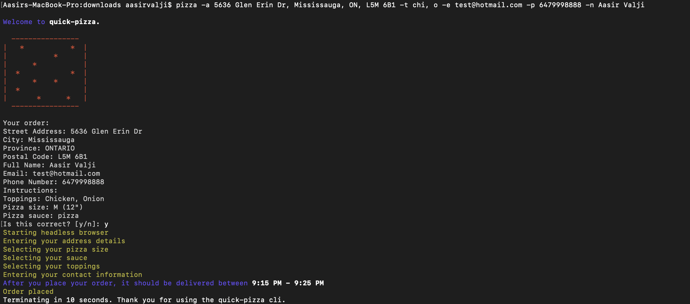

## Quick-pizza cli

Order a dominoes pizza in less than 20 seconds from your cli.

## Install and create global link

```
# Install dependencies
npm install

# Create a global link to the current folder so the command can be called from anywhere on the system
npm link

# Order your pizza
pizza [params]
```

## Cli order entry example



## Flags

```
# Mandatory flags
-a: The address the pizza should be delivered to -> -a <Street Address, City, Provice, Postal Code>
-t: The toppings you'd like on the pizza. Topping options are listed in toppingsMap.json -> -t <Topping 1>, <Topping 2>, etc...
-e: Your email address -> -e <Email>
-p: Your 10 digit phone number -> -p <Phone number>
-n: Your full name -> -n <First name> <Last Name>

# Optional flags
-si: Size of the pizza. Size options are in pizzaSizes.json. Default size is "m" (medium) -> -si <Pizza Size>
-sa: Sauce on the pizza. Sauce options are in sauces.json. Default sauce is "pizza" ("Original pizza sauce") -> -sa <Pizza Sauce>
-i: Instructions upon delivery. Default is no entry for instructions -> -i <Instructions>

```

## Future improvements

```
- Add a --save option that allows the user to save their current order for future use.
- Create a interactive menu that allows the user to choose thier order options instead of using flags.
```

- Version: 1.0
